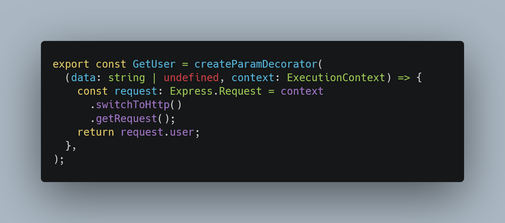
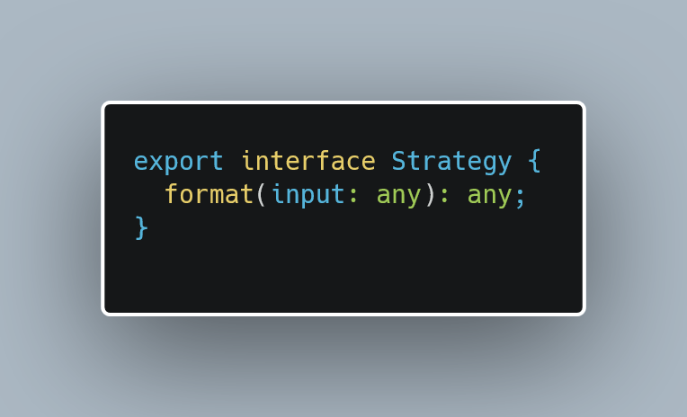
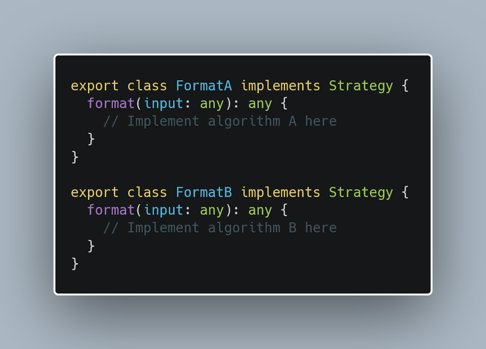
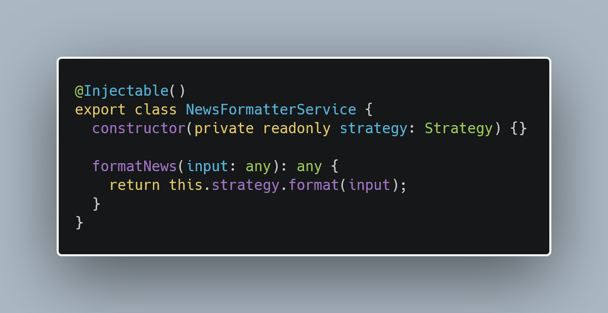
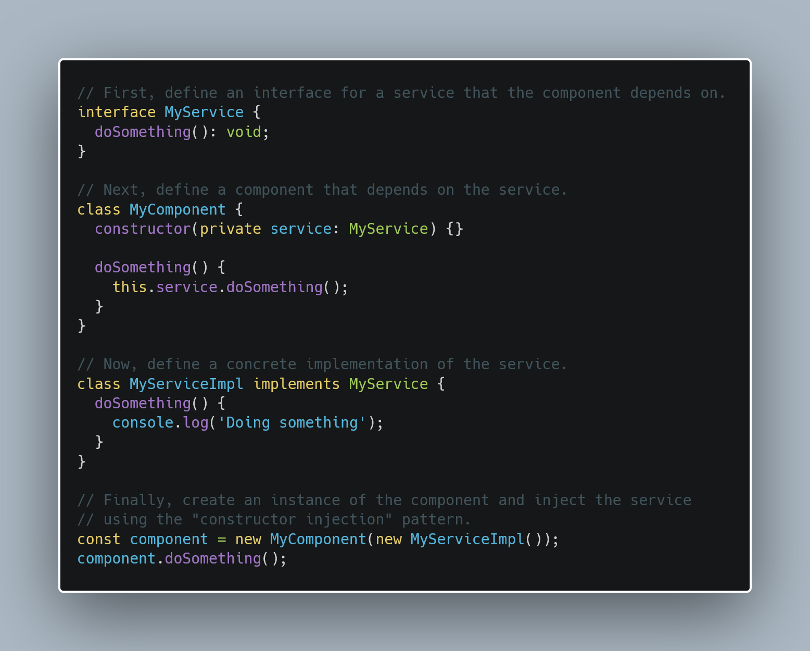
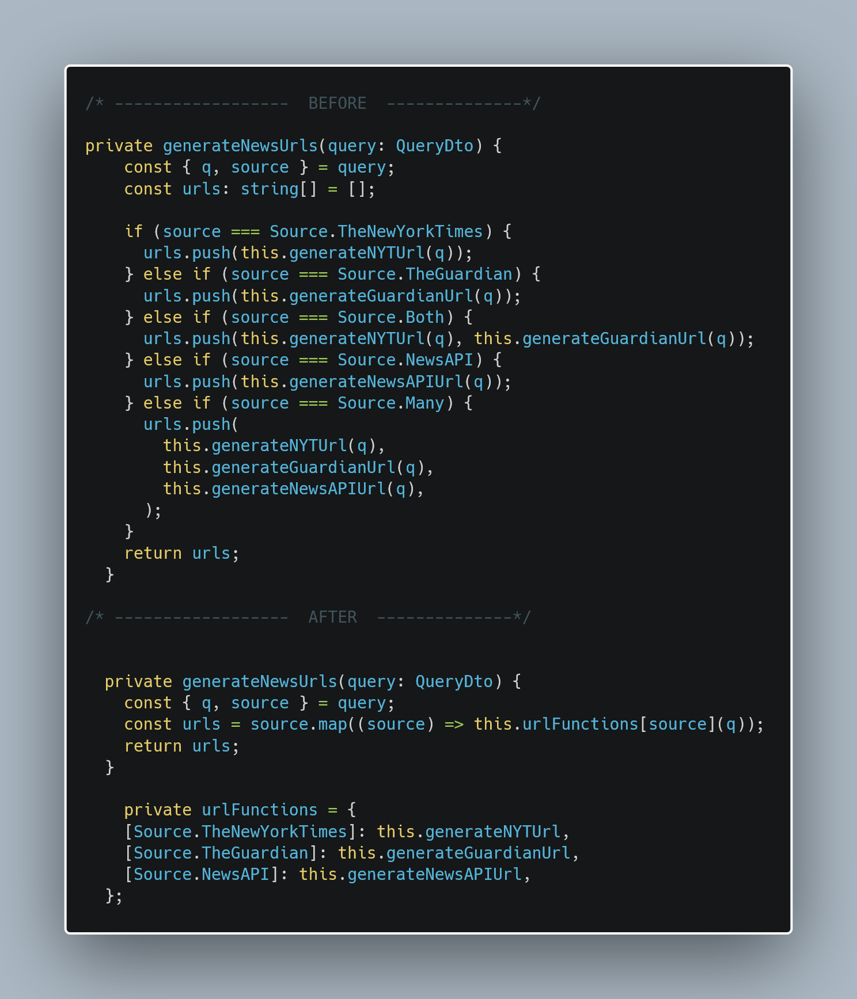
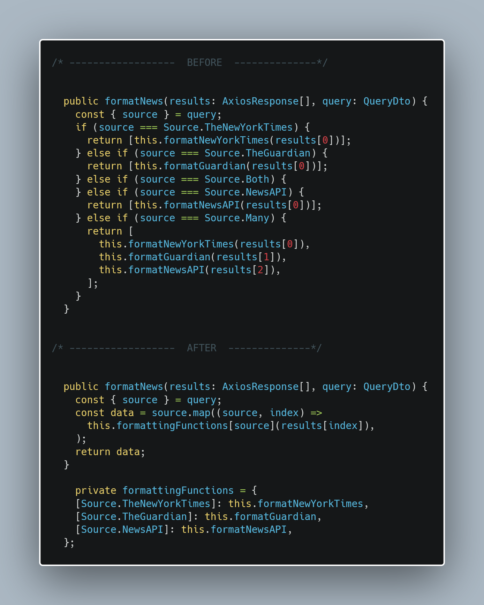
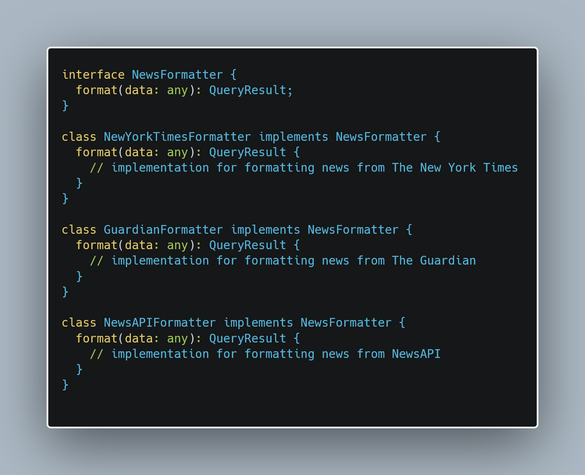
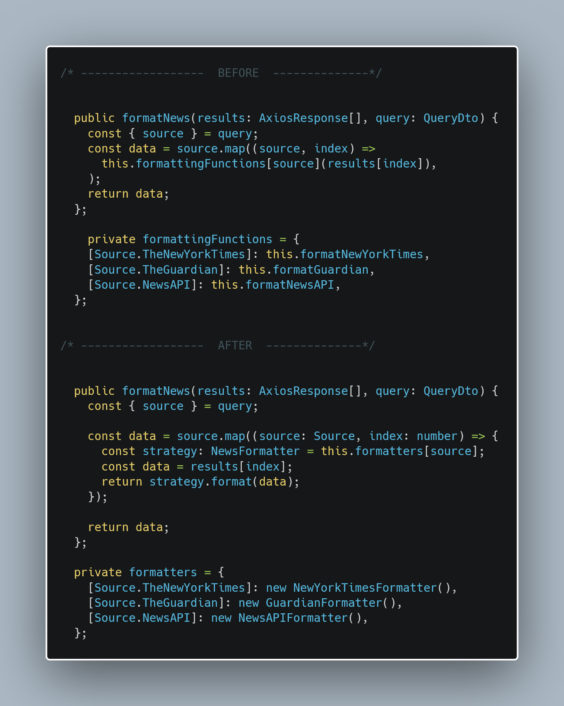
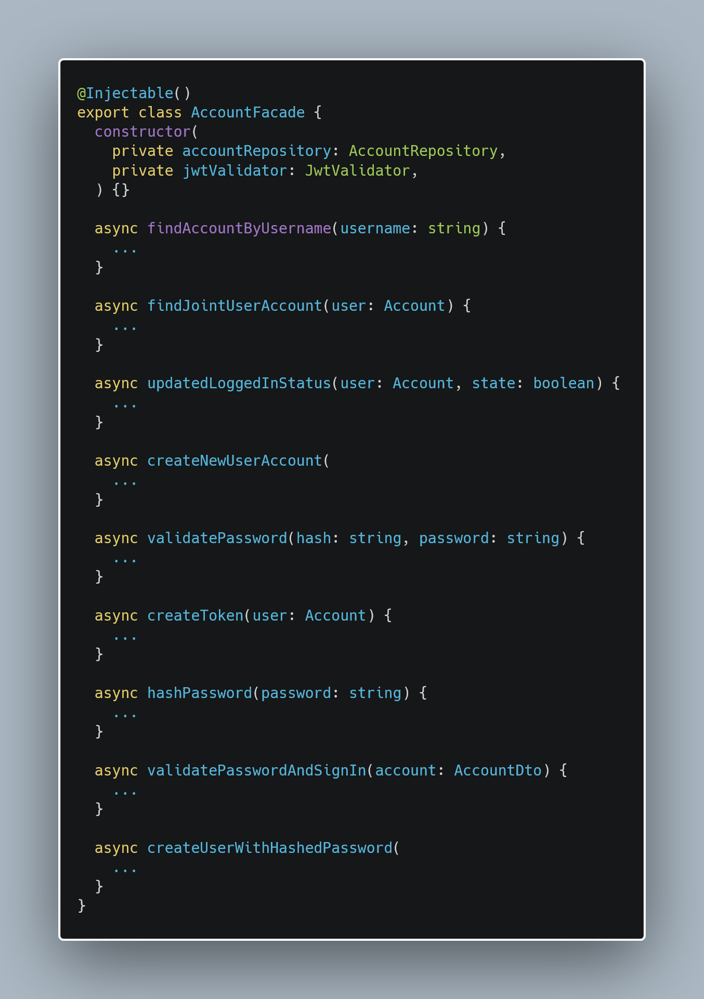

## Description

API to aggregate the news result from searching articles in The Guardian's API and The New York Time's API using a unified interface.

## Installation

```bash
$ npm install
```

## Running the app

### Environments

This API supports multiple environments by providing the appropriate .env file, it's recommended to use the dev environment

```bash
$ npm run start:dev
```

An API key must be provided for all the news API's

### Database

For the current version postgresql is being used as a database

## Endpoints

### Authentication

User authentication endpoints work as follows:

### Sign Up

```
POST /api/v1/auth/signup
```

a body containing all the signup information has to be provided:

```typescript
{
    "first_name": string,
    "last_name": string,
    "email": string,
    "username": string,
    "password": string
}
```

### Sign In

After creating a user, to be able to access the rest of the endpoint you must sign in through the endpoint:

```
POST /api/v1/auth/signin
```

the credentials for log in must be passed through the request body:

```typescript
{
    "username": string,
    "password": string
}
```

which will generate a response containing the jwt token needed to access everything else (expires in 1 day),
this token must be provided through a header

```
Authorization: Bearer <jwt provided after signin>
```

#### Sign Out

When the user wants to signout they must hit the following endpoint:

```
POST /api/v1/auth/signout
```

and by means of detecting the jwt in the header the database will be updated to change the state of the user to logged out

### News Query

it requires two query parameters to be provided (validated on start)

```

GET /api/v1/news?q=<query string>&source=<nyt|guardian|newsapi|many>

```

#### Response

If able to connect to the APIs and also authenticated the response will have the following interface:

```typescript
{ data:
  [
    {<response from The New York Times>},
    {<response from The Guardian>},
    {<response from ...>}
  ]
}
```

The interface for each response will be:

```typescript
{
  source: string;
  status: string;
  numberHits: number;
  results: [
    {
      publishDate: string;
      type: string;
      section: string;
      title: string;
      url: string;
      author: string;
    },
    {<article 2>},
    {<article 3>},
    ...
  ]
}
```

#### News Save and Retrieve

to be able to save a news article we post request:

```
POST /api/v1/news/save
```

where the request body must have the following info:

```
{
    "url": url;
}
```

the id of the user is encoded into the jwt so there is no need to pass it through the body

validation of url shape is enabled

all saved articles can be retrieved by means of this endpoint:

```
GET /api/v1/news/mysaved
```

the response will contain all the saved articles with the following info:

```typescript
{
    "user_id": number,
    "email": email,
    "articles": [
        {<saved article 1>},
        {<saved article 2>},
        {<saved article 3>},
        ...
    ]
}
```

where each saved article will have the following shape:

```typescript
{
"article_id": number,
"title": string,
"url": url,
"publish_date": Date,
"type": string,
"author": string,
"section": string
}
```

#### user CRUD

crud operations on users is also supported through the endpoints:

```
GET /api/v1/users
GET /api/v1/users/id
PATCH /api/v1/users/id
DELETE /api/v1/users/id
```

where the body for a PATCH request should be:

```typescript
{
    "first_name": string,
    "last_name": string,
    "email": string
}
```

Creation of new users is reserved to authentication endpoints

---

---

# WEEK 7 HOMEWORK

## Which patterns does Nest.JS use? Why? How are they implemented?

In terms of design patterns, NestJS makes use of several common design patterns found in object-oriented software development, including:

- Dependency Injection: NestJS makes use of the dependency injection design pattern, which allows the framework to provide dependencies (such as services, controllers, and other objects) to other objects in a flexible and decoupled way. This makes it easier to test and maintain the application, as well as to swap out dependencies with alternative implementations if needed.

- Modules: NestJS organizes the application into a hierarchy of modules, with each module representing a cohesive unit of functionality. This makes it easier to organize and structure the application, as well as to reuse code across different parts of the application.

  - modules are defined through the use of the @Module() decorator

- MVC: NestJS uses controllers to handle incoming HTTP requests and return appropriate responses. Controllers are responsible for handling the request, performing any necessary business logic through services, and returning a response to the client; Typeorm is tightly incorporated into Nest allowing for entities to be defined which act like the traditional models in the MVC pattern

  - Controllers are defined through the use of the @Controller() decorator which allows for options to be passed such as path and version
  - Services are then passed to a controller which need to define the @Injectable() decorator to support Dependency Injection

- Chain of responsability: NestJS implements several middleware abstractions to handle pre or post request data validation, authentication and transformation:
  - Pipes to validate and transform incoming request data before it is passed to a controller
  - Guards to handle authorization at the controller or endpoint level
  - Interceptors to wrap the request-response lifecycle and sanitize output or pre-handle requests
  - Exception filters to handle errors efficiently

---

## Which patterns can be used in your application? How those patterns could be implemented?

- Decorator can be used to handle parsing of the request object, for example in my application i'm using a custom decorator to extract the user payload after JWT validation

  <br />
   <br/>
  <br />

- Strategy can be a useful design pattern that can be used for the news module for the formatting of each news sources since all of them contain different responses, a way to implement this could be:

Create a strategy interface that defines our format method.
<br />

<br />
<br />
Create concrete implementations of the Strategy interface for each format algorithm.
<br />
<br />

<br />
<br />
Inject the desired format strategy into our formatting service
<br />
<br />

<br />

---

## Explain how to implement the Dependency Injection pattern in typescript. Include a code example

<br />
<br />

<br />
<br />

In this example, the MyComponent class depends on the MyService interface, but it doesn't know anything about the concrete implementation of the service. When the component is created, it is given an instance of MyServiceImpl, which is a concrete implementation of the MyService interface. This allows the component to use the service without knowing anything about how the service is implemented.

The last part of the code handles instantiation of a dependency manually but this can be delegated to a framework or package such as 'inversify'

---

## What is an anti-pattern?

In software development an antipattern is a commonly used solution to a problem that is inefficient or conceptually convoluted, it does not respect the principle of declarative code and usually derives from trying to solve a problem procedurally.

their counter-part are design patterns which leverage principles like SOLID and concepts of OOP.

some common anti-patterns are:

- The "Golden Hammer" antipattern, where a single tool or solution is applied to every problem, regardless of whether it is the most appropriate solution.

- The "Not Invented Here" antipattern, where a team or organization insists on developing everything in-house, even when off-the-shelf solutions are available.

- The "Premature Optimization" antipattern, where a team spends a lot of time optimizing a solution before it is even clear that the optimization is necessary.

---

## Homework Refactor

### Antipattern: conditional logic

On the news module i defined two services that deal with fetching results from APIs and formatting this results.

The implementation relied heavily on if conditionals that decided what sources the results should come from and what formatter functions to apply to them:

- For the news-grabber service:
  <br />
  <br />
  
  <br />
  <br />
- For the news-formatter service:
  <br />
  <br />
  
  <br />
  <br />

### Design Pattern: Strategy

Then to be able to abstract the formatting logic the strategy pattern was implemented as follows:

- A common formatter interface is defined and formatting classes implement the format method, each in their separate:

  <br />
  <br />
  
  <br />
  <br />

- The format service is updated by using this interface and concrete instances of each formatter:

  <br />
  <br />
  
  <br />
  <br />

### Antipattern: Blob

when dealing with entities, my implementation relied on injecting repositories into the services called by the controllers, this approach inherently mixed the bussiness logic and handling database transactions within a single method multiple times and forced said methods to be long and unreadable, therefore the anti-pattern blob was being used.

the logic for dealing with entities and databases was abstracted to custom repositories implemented by use TypeORM's Repository<T> object

the updated files that implement this refactor are:

```
./news/news.service.ts
./users/users.service.ts
./auth/auth.service.ts
```

within each of this files an @Injectable() repository is being passed to the constructor that points to it's related entities, therefore using dependency injection.

### Desing Pattern: Facade

To be able to separate the implementation of the custom repositories, specifically for the auth module, a Facade was implemented with ready-made methods that perform calls to the custom repository and to another subsystem that handles jwt validation

  <br />
  <br />
  
  <br />
  <br />

## Summary

### Antipatterns

- Blob
- Conditional logic

### Design Patterns

- Strategy
- Facade
